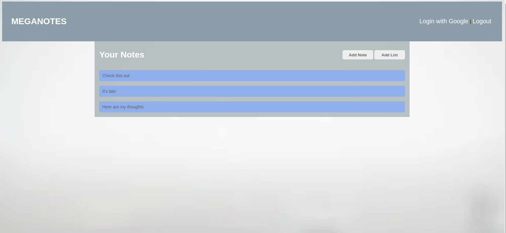

# MEGANOTES

This is a project with the goal of learning the use of authentication systems, CRUD operations with databases, planning and execution of database structures, application frameworks, and learning how to make nicer README files.

## Technologies
- NodeJs Express web application framework
- Mongo DB
- Mongoose
- Google Oauth
- HTML
- CSS
- JavaScript

## Getting Started
As a frequent user of Keep notes from Google, I thought creating something similar would be a great learning experience, with the hope to add features, I wish Keep notes would have. 

See the project [here.](https://meganotes.herokuapp.com/)

See the Trello board [here.](https://trello.com/b/TWQ5hkZ7/note-collections)

## Next Steps
 - MVP: visual and some operational improvements on modals
 - Notes that store links to images and videos and display in a gallery
 - Note sharing with other users
 - Search functionality
 - API connected notes (jokes, weather, etc.)